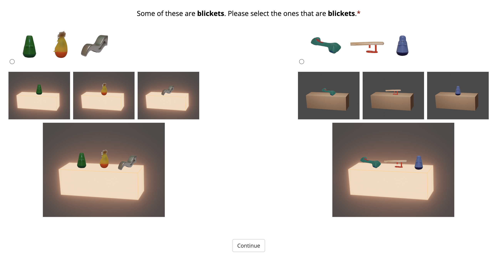

To become productive users of a language, children must acquire not only the semantics of language (the meaning of expressions) but also its syntax (lexical categories and grammatical rules). Yet these processes are not necessarily independent. Previous studies have argued that during acquisition, syntactic categories and semantic meanings constrain one another, such that language learners can exploit such relationship to reduce the hypothesis space that they need to consider when faced with a novel word or utterance, i.e., through a bootstrapping process [@gleitman1990; @naigles1996; @pinker1984; @macnamara1972; @braine1987].

One test case for how syntax and semantics might interact to guide language acquisition is the mass-count distinction, which exists in many languages, including English. In English, count nouns (such as *cat* or *table*) typically can be pluralized, while mass nouns (such as *sand* or *water*) typically cannot, without changing category. Count nouns can be modified by cardinal numbers (*one*, *two*, *three*), and certain modifiers such as several, many, these, those -- none of which can be used to modify mass nouns [@jespersen1909]. According to some previous studies, these syntactic categories correspond to a clear-cut semantic distinction, such that count nouns always refer to countable entities, like objects, while mass nouns refer to non-countable entities, like substances. By noticing that a word refers to a countable thing, children might classify it as a count noun. And by extension, by noticing that a word occurs in count syntax, they might infer that it refers to a countable entity in the world.

This kind of approach is premised on the idea that a clear correspondence exists between the syntax and semantics of mass and count nouns. In particular, @quine1960 proposes that words used with count syntax denote individuated, countable, entities, while mass nouns denote unindividuated and uncountable phenomena [see also @bloom1994; @bloom1999; @gordon1985; @gordon1988; @link1983; @wisniewski1996]. These mappings between the mass-count syntax status of a word, and its referent's status as an individuated object, are hypothesized to aid acquisition in a bootstrapping process: @macnamara1972 suggests that language users use individuation in acquiring mass-count syntax: learning nouns that refer to individuated objects as count nouns, and nouns that refer to unindividuated objects as mass nouns [see also @braine1992].

In support of the syntax-semantics bidirectional mapping theory, children have been shown to distinguish between countable individuals and uncountable phenomena, making it a viable semantic distinction to bootstrap acquisition of mass-count syntax. Prelinguistic infants are able to track individuated objects under occlusion [@carey2001; @feigenson2003], but fail to track non-individuated substances [@huntley2002]. Also, children as young as 2 years old are able to differentiate between objects and substances, and extend novel words differently based on that distinction. When given a novel label in neutral syntax (e.g., 'the garn'), and a choice that matches the original exemplar by shape and another choice matching by substance, 2-year-olds are more likely to select the shape-match when the original exemplar is an object with definite shape. In contrast, they are more likely to select the substance-match when the original exemplar is a substance with non-definite shape. Additionally, 2-year-old Japanese children also distinguish between individuated objects and non-solid substances in a similar word extension task, while having no mass-count distinction in their native language [@imai1997]. These results support the view that there exists a prelinguistic ontological distinction of 'individual,' that could be utilized to bootstrap acquisition of novel labels as mass for non-solid substances, or otherwise non-individuated items, or count for solid objects, or otherwise individuated items [see also @imai1994; @landau1988; @samuelson1999].

However, distinction between ontological categories like object/substance has been shown to not be the only factor driving acquisition of mass-count syntax [@gathercole1985; @gordon1985; @gordon1988]. @gordon1985 showed that children between 3;5 and 5;5 used syntactic cues to make inferences about a novel label's referent, even when they were given conflicting syntactic and semantic cues. Children were shown either a novel object or some liquid in a test tube. The experimenter then named the object or the substance with a label in either a congruent syntax or a conflicting syntax (for example, with the liquid, the child either heard "this is some garn" in the congruent syntax condition, and "this is a garn" in the conflicting syntax condition). Children were then shown a group of many objects or a group of many liquid-containing test tubes, and asked to complete a sentence referring to them. Notably, in the conflicting condition where syntactic and semantic cues pointed to different inferences, children preferred to use the syntactic cue: for example, pluralizing the novel label when it was introduced as 'a garn' (count syntax), even when it referred to a liquid. The bias towards the syntactic cues increases in older children and adults [@bloom1995]. @gordon1985 interpreted these results to show that children use mass-count syntax to make inferences about quantification -- whether a referent is countable or not, which might be independent from its ontological status as an object or a substance.

While results from previous studies have been conflicted in terms of the extent to which children use object/substance ontological distinction to acquire mass/count syntax, they establish syntax-semantics bidirectional mappings between mass-count syntax and quantification -- mass nouns refer to uncountable, non-individuated phenomena, while count nouns refer to countable, individuated objects. However, a problem with this account, noted as early as @quine1960 is that many apparent counter-examples exist [see also @gillon1992; @gillon1999; @chierchia1998]. One such example is that of mass superordinate nouns that refer to objects (for e.g., furniture, jewelry, silverware). The smallest constituent of furniture that could still be referred to as 'furniture' is individuated and countable (for e.g., one could still call a chair 'furniture', but not half a chair). However, the smallest constituent of substance-mass nouns such as water that could still be referred to as 'water' is unindividuated [@cheng1973]. In other words, referents of substance-mass nouns can be infinitely divided without losing its status as that noun, but this is not the case with object-mass superordinate nouns ["what is too small to count as furniture is not too small to count as water or sugar; so the limitation needed cannot be worked into any general adaptation of 'is' or 'is a part of'", @quine1960, pp. 99]. The extension of mass object-superordinate nouns (e.g., furniture) seems to be individuated objects ( e.g., chairs, tables, beds), contradicting the bidirectional mapping theory.

One way to rescue the theory in the face of such counterexamples is by considering individuation as the language user's construal of the referent as individuated entities or a non-individuated group, as opposed to its ontological status as object/substance [@bloom1994; @wierzbicka1988; @wisniewski1996]. According to @wisniewski1996, when a mass noun like *waterfowl* is used to refer to a collection of birds, the word does not refer to the birds as individuals, but instead as a group of unindividuated entities. In certain circumstances, a speaker might refer to a group of birds as *waterfowl* if she conceptualizes them as an unindividuated group, rather than as individual birds. The construal theory maintains the bidirectional mapping theory, only updating it so that the correspondence is between mass syntax and non-individuating construals, and count syntax and individuating construals (as opposed to ontological status of object/substance).

@barner2005 tested the construal theory for mass superordinate nouns (such as *furniture* and *silverware*) using a quantity judgment task, where participants were presented with two groups of objects and asked to choose which is "more". In the task, participants were shown two characters, and were asked, e.g., "Who has more shoes" in a context where one character had a greater number of items, and the other had a greater volume (e.g., a smaller number of big shoes). For count nouns like "shoe" it was expected that participants would base their quantity judgments on number, whereas for mass nouns like *butter* it was expected that they would base their judgments on volume. More important than these cases, however, were mass/count ambiguous nouns like *stone* or *string* where there were clear individuals in the world, but the items could be named with either mass or count syntax. In these cases, Barner and Snedeker found that participants based judgments on number when the nouns were presented in count syntax, but on volume when presented in mass syntax, suggesting that construal shifted as a function of syntax, and that the task was therefore sensitive to construal, and not merely upon whether or not there were discrete countable objects in the world.

Given this finding, Barner and Snedeker reasoned that if mass superordinate nouns such as furniture individuate, then participants should base judgments for these nouns on number, whereas if they don't then judgments should be based on volume. Compatible with the first hypothesis, when they tested participants with nouns including silverware, furniture, clothing, and mail, participants overwhelmingly selected the character who had a group of many small pieces of furniture over the character who had a group containing fewer, larger pieces of furniture. Based on this, Barner and Snedeker concluded some mass superordinate mass nouns (such as furniture) individuate, against the bidirectional mapping account.

However, others would argue that the contrast between individual quantity and mass quantity in @barner2005 does not test the semantics of mass superordinate nouns. For example, @mccawley1975 argued that the meaning of mass superordinate nouns like furniture is defined by abstract properties like the function fulfilled by objects, rather than their volume or their status as individuals. For example, according to McCawley, the meaning of 'furniture' is 'for furnishing', rather than 'pieces of things for furnishing' (an individuation meaning) or 'mass of things for furnishing' (a mass meaning). To demonstrate, consider the following scenario "Fred has 4 chairs, 3 magazine racks, 2 coffee tables, and 1 lamp. I have 2 chairs, 1 desk, 1 bed, 1 sofa, and 1 table." I have more furniture than Fred -- despite the fact that Fred has a higher number of pieces of furniture. Rather, the judgment of "more furniture" seems to rely on the criterion of being able to better fulfill the function of "furnishing a space" [see also @prasada1999].

@grimm2012 provided empirical evidence for McCawley's observation. Participants were asked to decide who has "more" of a mass superordinate noun (such as jewelry or furniture): one person has more number of pieces but less variety, and the other person has fewer number of pieces but more variety [similar to the scenario posed in @mccawley1975]. They found that for half of the mass superordinate nouns they investigated (*furniture*, *jewelry*, *change*), participants were more likely to judge a higher extent of function-fulfillment as "more" compared to a higher number of pieces. The judgment based on function were significantly less available for count superordinate nouns (such as *buildings* and *tools*), in which case participants overwhelmingly chose the person with a higher number of pieces as having "more" [for an earlier unpublished study using the same logic, see also @gordon2006].

One way to reconcile the findings in @grimm2012 and @barner2005 is with the mass non-specificity theory [@gillon1999, see @barner2006 for a similar proposal]. This theory proposes that count syntax denotes individuals, but mass syntax is unspecified in terms of individuation. In this view, mass syntax is unspecified and allows for both individuation and non-individuation inferences. Context may guide whether, and over what dimension, language users construe mass nouns as individuals. In normal circumstances, one might judge that someone with more variety of furniture has more furniture, as opposed to a person with more individual pieces of furniture but less variety [@mccawley1975]. However, in a situation where the furniture has to be moved, one might judge that someone with more individual pieces of furniture, or more mass of furniture, has more furniture despite less variety.

A drawback of previous studies that investigate mass superordinate nouns is that they did not investigate semantic inferences of count superordinate nouns. While @grimm2012 did include count superordinate nouns and found that participants preferred to quantify them by number of individual pieces, the count nouns included do not refer to the same phenomena as the mass nouns. This leaves open the possibility that the difference observed in quantification criterion might not stem from mass-count syntax, but rather from an inherent physical reality of the referents. In other words, perhaps the referent of *furniture* would always be unspecified and allow for flexible individuation or non-individuation inferences, whether its label has mass or count syntax. Similarly, it is possible that the referent of *tools* might always be quantified as individuals regardless of its syntax.

@wisniewski1996 took a different approach and investigated semantic inferences of both object-mass and object-count superordinate nouns in English. Adult English speakers were asked to generate salient features for mass superordinate nouns (such as *furniture*) and count superordinate nouns (such as *buildings*). They made more references to interactions that involve multiple members of a category concurrently for mass superordinate nouns -- for example, 'eat' for *food* (we often eat multiple types of food at the same time). Meanwhile, participants made more references to interactions involving an individual member of the category for count superordinate nouns -- for example, 'play' for *musical instruments* (we often play only one musical instrument at a time). Additionally, adult participants judged exemplars from mass superordinate categories to co-occur more often than those from count superordinate categories.

From these results, @wisniewski1996 proposed functional context as a semantic contrast that can be inferred from the mass-count syntax status of superordinate nouns. Specifically, this contrast differentiates superordinate categories whose members are involved in a function concurrently (Concurrent Function Context), mapping them to mass syntax, from those with members who are involved in a function individually (Individual Function Context), which are mapped onto count syntax. This view is compatible with the syntax-semantics bidirectional mapping theory, because it establishes a one-to-one correspondence between mass-count syntax and semantic inferences. The view predicts that category members in Concurrent Function Contexts would be perceived as non-individuated objects, and that when a syntactically ambiguous label is provided for the category, learners should assume that it is a mass noun. In contrast, category members in Individual Function Contexts would be perceived as individuated objects, and learners should assume that category labels are count nouns. Similarly, learners should infer that novel superordinate mass nouns refer to category members that concurrently participate in a function, whereas they should infer that novel count nouns refer to category members that fulfill a function individually. To illustrate, *furniture* is a mass superordinate noun, resulting in its exemplars (e.g., chairs and tables) being perceived as a group of non-individuated objects that concurrently participate in a *furnishing* function (i.e., a single chair cannot furnish). Meanwhile, *tools* is a count superordinate noun, which results in its exemplars (e.g., hammers and saws) being perceived as individuated objects that can individually fulfill a repairing function.

The current study tests whether Concurrent vs Individual Function Context is a semantic distinction spontaneously inferred from the mass-count status of a superordinate noun. Specifically, on the bidirectional syntactic-semantic mapping theory, it is expected that a superordinate mass noun should lead to the inference that its exemplars are more likely to be involved in a function concurrently (Concurrent Function Context). Whereas a superordinate count noun should lead to the inference that its exemplars are more likely to be involved in a function individually (Individual Function Context).

# Methods

```{r setup, echo = FALSE, include = FALSE}
library("papaja")
library("knitr") # for knitting things
library("tidyverse") # for all things tidyverse
library("car")
library("lme4")
library("patchwork")
library("effsize")
library("purrr")
library('ggplot2')
library('car')
library('brms')
library('emmeans')
library('easystats')

# these options here change the formatting of how comments are rendered
opts_chunk$set(
  comment = "",
  results = "hold",
  fig.show = "hold", 
  echo = F, warning = F, message = F, sanitize = T)

#options(mc.cores = parallel::detectCores())

# set the default ggplot theme 
theme_set(theme_apa())

```

```{r loading data, warning=FALSE, include=F}
df.demog <- read.csv("../data/PROCESSED_DATA/demog.csv")
df.response <- read.csv("../data/PROCESSED_DATA/response.csv")
```

## Participants

Data collection and analyses for this study were preregistered, and the pre-registration is available at <https://osf.io/bkmes>. We recruited 119 adult native English speakers from the online platform Prolific[^1]. 9 participants failed the comprehension checks before any critical trials, and we did not collect any data from these participants. All participants live in the US and have English as their first language. We had pre-registered an exclusion criterion to exclude any participants who are fluent in another language other than English (self-reported 6 or more out of 10 in speaking and comprehension), but we did not find any participants who needed to be excluded based on this criterion. Participants from whom we collected data were compensated with \$2 through the Prolific platform.

[^1]:Due to a technical error, we recruited an additional 11 participants. Their data was not included in the analysis, nor looked at by the researchers.

Our final sample included `r length(unique(df.demog$subject_id))` participants (`r df.demog %>% filter(demog_question == "gender") %>% filter(demog_response == "Male") %>% count(demog_response) %>% pull(n)`M, `r df.demog %>% filter(demog_question == "gender") %>% filter(demog_response == "Female") %>% count(demog_response) %>% pull(n)`F, `r df.demog %>% filter(demog_question == "gender") %>% filter(demog_response == "Non-binary") %>% count(demog_response) %>% pull(n)` non-binary), with mean age = `r round(df.demog %>% filter(demog_question == "age") %>% summarise(mean_age = mean(as.numeric(demog_response))) %>% pull(mean_age), 2)` (SD = `r round(df.demog %>% filter(demog_question == "age") %>% summarise(sd_age = sd(as.numeric(demog_response))) %>% pull(sd_age), 2)`).

Participants were randomly assigned to the mass syntax and count syntax conditions, with n=`r df.demog %>% filter(condition == "mass") %>% group_by(subject_id, condition) %>% summarise(rows = n()) %>% select(-rows) %>% group_by(condition) %>% count(condition) %>% pull(n)` for each condition in our final sample.

```{r summarize ppt, eval = F}
df.demog %>%
  filter(demog_question == "gender") %>%
  count(demog_response) %>%
  knitr::kable()

df.demog %>% 
  group_by(subject_id, condition) %>%
  summarise(rows = n()) %>%
  select(-rows) %>%
  group_by(condition) %>%
  count(condition) %>%
  knitr::kable()

df.demog %>% 
  filter(demog_question == "age") %>%
  summarise(mean_age = mean(as.numeric(demog_response)), 
            sd_age = sd(as.numeric(demog_response))) %>%
  knitr::kable()
```

## Design

We designed the experiment to be a between-subject design with 2 conditions (Syntax: Mass, Count). We manipulated the syntax seen by each participant to be either mass or count, which is operationalized by the morphosyntactic form of the novel word. For example, for the novel label *garn*, in the mass condition, participants saw the prompt 'Some of these objects are *garn*. Please select the ones that are *garn*.' In the count condition, participants saw the prompt 'Some of these objects are *garns*. Please select the ones that are *garns*.'

The dependent variable we were interested in is the semantic inference made by participants in terms of functional contexts. This had two levels: Individual Functional Context and Concurrent Functional Context. These functional contexts were operationalized as the pattern of interaction between groups of three objects and a 'detector' that can be activated by one object and/or the entire group of objects. In the Individual Functional Context, each object in the group activates the detector individually, and the entire group also concurrently activates the detector. In the Concurrent Functional Context, the detector is only activated by the entire group, but not by each object individually. The detector is 'activated' if it lights up when an object or a group of objects are placed on it, and is not 'activated' if it does not light up.

## Material

All stimuli and scripts for the experiment and analysis are available at <https://osf.io/ay2um/>. The novel objects used to form novel categories were chosen from the stimuli in the Novel Object and Unusual Name (NOUN) Database [@horst2016]. We grouped objects based on their perceived complexity and functionality. Complexity and functionality have been found to modulate semantic inferences of novel labels. When adult English speakers are taught novel labels with a single exemplar, exemplars that are more complex or judged to be more likely to have shape-dependent function are more likely to be extended to a shape-match item rather than a substance-match item [@li2009]. Additionally, when asked to choose between two sentences to refer to a novel item, adult participants are more likely to construe the item as an individuated object (operationalized as choosing to describe the item with a syntactically-count label) if the item has shape-dependent function [@prasada2002], as opposed to shape-independent function. These results suggest that complexity and functionality might determine differing base rates of semantic inferences of objects, with more complex and more functional objects being more likely to be construed as individuals. We might reason that in our paradigm, categories with objects that are more complex and more functional might be construal more individually and thus have a higher baseline for being interpreted to have Individual Functional Context semantics, regardless of the mass-count syntax manipulation.

To obtain the objects' complexity and functionality ratings, we carried out a norming study with 38 participants who are undergraduates at University of California, San Diego. During the study, we asked the participants to rate 64 objects from the NOUN Database on their shape-wise complexity and how likely they are to have a function. Participants made their ratings on a Likert scale from 1 to 7. On the complexity scale, 1 means low complexity and 7 means high complexity. On the function scale, 1 means very unlikely to have a function and 7 means very likely to have a function. After excluding three participants who did not pass all attention checks and three participants who are beyond +-2.5 SD of the mean for the two familiar training images (a fork and a pile of dirt), we obtained ratings for 64 objects from 32 participants in total. We then created five groups of objects with six objects each, based on the relative complexity and function ratings, forming five novel categories. We pseudo-randomly separate each group of six objects into two sub-groups of three objects each. The composition of each sub-group for each category is consistent across participants. The details for these categories are in Table 1.

```{r}
category_name <- c("high C, high F", "high C, low F", "low C, high F", "low C, low F", "medium C, medium F")
mean_complexity <- c(4.99, 4.56, 2.54, 2.69, 3.87)
mean_fn <- c(4.39, 2.80, 4.36, 2.63, 3.44)
df.category <- data.frame(category_name, mean_complexity, mean_fn)

apa_table(
  df.category
  , caption = "Complexity and Functionality ratings of the 5 categories, out of a 1-7 Likert scale."
  , note = "In the Category column, C stands for Complexity, F stands for Functionality."
  , escape = TRUE,
  col.names = c("Category",
                           "Mean Complexity Rating",
                           "Mean Functionality Rating")
)
```
The critical trials were presented as a two-alternative forced-choice task. In each trial, participants were prompted with a novel label (*zorp*, *garn*, *blicket*, *toma*, *sarel*), and shown the two sub-groups of a category. Each sub-group of objects was randomly assigned to either carry the Individual Functional Context semantic meaning, or the Concurrent Functional Context semantic meaning. There are 5 critical trials in total. The order of trials and novel labels shown are counterbalanced across participants.

## Procedure

```{r my-figure, fig.cap = "Example of a critical trial in the count syntax condition."}

```

Participants were randomly assigned either to the mass or count syntax condition. They first saw a series of familiarization videos that introduced them to the detector and how it can be activated by an individual object or a group of three objects. Participants then answered comprehension check questions regarding two groups of objects with different patterns of interaction with the detector. For each group of objects, participants were asked whether each object activated the detector, and whether the entire group of objects activated the detector. The questions were presented on the same page as the information on the relevant objects' patterns of interaction with the detector, creating two blocks of four questions each. Participants had three opportunities to answer each block of questions correctly. If they failed the comprehension checks, they did not proceed to the critical trials.

Qualified participants then answered the 5 critical trials. In each trial, participants saw a prompt with a novel label word in either mass or count syntax based on the condition they are assigned to (Mass condition: "Some of these are *zorp*. Please select the ones that are *zorp*". Count condition: Some of these are *zorps*. Please select the ones that are *zorps*.) Participants indicate whether they think the label refers to the sub-group in the Individual Functional Context, or the sub-group in the Concurrent Functional Context (Figure 1). They were then asked what strategies they used to answer the questions, and demographic questions about age, gender, ethnicity, primary language, other languages and their fluency.

# Results

## Semantic inferences of mass-count syntax.

```{r figure1, fig.cap="Proportion of semantic inferences by syntactic condition (Concurrent Functional Context and Individual Functional Context are dummy-coded as 1 and 0 respectively). Each gray dot indicates a participant’s mean selection. Error bars indicate bootstrapped 95% confidence interval."}

ggplot(data = df.response %>%
         group_by(subject_id, condition) %>%
         summarise(mean_concurrent_func = mean(selected_concurrent_func, na.rm = TRUE)),
       mapping = aes(x = condition, y = mean_concurrent_func)) + 
  geom_violin(aes(fill = condition)) +
  geom_jitter(height = 0, 
              alpha = 0.3) +  
  stat_summary(fun.data = "mean_cl_boot", 
               geom = "pointrange") +
  theme(legend.position = "none") + 
  geom_hline(yintercept = 0.5, linetype = "dashed") + 
  ylab("Proportion Concurrent Function Selection") + 
  xlab("Syntactic Condition")
```

```{r ttest, include = F}
t.test_mass <- apa_print(t.test(df.response %>% 
         filter(condition == "mass") %>% 
         group_by(subject_id) %>%
         summarise(mean_prop_concurrent_func = mean(selected_concurrent_func, na.rm = T)) %>% 
         pull(mean_prop_concurrent_func),
         mu = 0.5, alternative = "two.sided"))

t.test_count <- apa_print(t.test(df.response %>% 
         filter(condition == "count") %>% 
         group_by(subject_id) %>%
         summarise(mean_prop_concurrent_func = mean(selected_concurrent_func, na.rm = T)) %>% 
         pull(mean_prop_concurrent_func),
         mu = 0.5, alternative = "two.sided"))
```

Participants' responses are summarized in Figure 2. Two-sided one-sample t-tests for each syntax condition show that, against the predictions of the bidirectional mapping theory, proportion of Concurrent Functional Context selection is not significantly different from chance in both conditions (mass condition: `r t.test_mass$statistic`; count condition: `r t.test_count$statistic`).

```{r include = F}
fit.base <- glmer(selected_concurrent_func ~ 1 + (1|subject_id) + (1|category), data = df.response, family="binomial")
summary(fit.base)
fit.base.anova <- Anova(fit.base, type = 3)

fit.cond <- glmer(selected_concurrent_func ~ condition + (1|subject_id) + (1|category), data = df.response, family="binomial")
summary(fit.cond)
fit.cond.anova <- Anova(fit.cond, type = 3)

fit.cond_compare <- anova(fit.cond, fit.base, type = 3)
```

In order to test the effect of syntax on semantic inferences of functional context, we ran a mixed-effects logistic regression model predicting Functional Context selection (Concurrent Functional Context and Individual Functional Context) with Syntax (Mass and Count) as fixed effects. As random effects, we included an intercept per participant and one per category. We found no significant effect of syntax on Functional Context selection ($\beta_{mass}$ = `r round(fixef(fit.cond)["conditionmass"], 2)`, p `r ifelse(fit.cond.anova["condition", "Pr(>Chisq)"] > 0.001, paste0("= ", round(fit.cond.anova["condition", "Pr(>Chisq)"], 3)), "< .001")`).


```{r bayes, cache=TRUE, include = F}
fit.brm_bf1 = brm(formula = selected_concurrent_func ~ 1 + (1|subject_id) + (1|category),
                        data = df.response,
                        save_pars = save_pars(all = T),
                        file = "cache/brm_bf1")
fit.brm_bf1.summary <- summary(fit.brm_bf1)

fit.brm_bf2 = brm(formula = selected_concurrent_func ~ condition + (1|subject_id) + (1|category),
                        data = df.response,
                        save_pars = save_pars(all = T),
                        file = "cache/brm_bf2")
fit.brm_bf2.summary <- summary(fit.brm_bf2)

fit.brm_bf2.bayes <- bayes_factor(fit.brm_bf2, fit.brm_bf1)
```

Another question was whether this result provides support for the null hypothesis, where syntax has no effect on semantic inferences. In order to probe this, we conducted an exploratory analysis by fitting a Bayesian linear model (estimated using MCMC sampling with 4 chains of 300 iterations and a warmup of 150) to predict Functional Context selection with Syntax, with random intercepts for participant and category, and default (weakly informative normal) priors. We did not observe a reliable effect of syntax ($\beta$ = `r round(fixef(fit.brm_bf2)["conditionmass", "Estimate"], 2)`, 95% CI = [`r round(fit.brm_bf2.summary$fixed["conditionmass", "l-95% CI"], 2)`, `r round(fit.brm_bf2.summary$fixed["conditionmass", "u-95% CI"], 2)`]), confirming our analysis using the mixed-effects logistic regression model. To evaluate evidence for the null hypothesis – that syntax has no effect on semantic inference, we compare support for the test model to a null constant model with identical structure and omitting the syntax fixed effect. The estimated Bayes Factor in favor of the test model over the null model was `r round(fit.brm_bf2.bayes$bf, 3)`, which suggests moderate evidence for the null model [@lee2013].

## Exploratory Analysis: Moderation of semantic inferences by complexity and functionality. 
Previous studies have shown that complexity and functionality might affect whether an entity is construed as an individuated object [@li2009; @prasada2002], and whether its label is learned as a mass or count noun [@barner2005mckeown]. As an exploratory analysis, we investigate whether complexity and functionality of item categories might modulate semantic inferences. By-trial responses are summarized in Figure 3, grouped by category. Two-sided one-sample t-tests show that proportion of Concurrent Functional Context selection does not significantly differ from chance for any category (p > .05). We ran mixed-effects logistic regression models with the same effects structure as above and added either Complexity (high, low, medium), Functionality (high, low, medium),interaction of Complexity and Functionality, or Category (5 levels as described in Table 1) as fixed effects. We found no significant effect for any of the additional predictors (p > .05).

```{r, fig.cap ="Proportion of semantic inferences by syntactic condition and item category. On the x-axis, C stands for Complexity, F for Functionality. Each colored dot indicates a critical trial. Error bars indicate bootstrapped 95% confidence interval."}
ggplot(data = df.response,
       mapping = aes(x = category, y = selected_concurrent_func, color = condition)) + 
  geom_jitter(height = 0, 
              alpha = 0.5) +  
  stat_summary(fun.data = "mean_cl_boot", 
               geom = "pointrange", 
               position = position_dodge(0.7))  + 
  theme(axis.text.x = element_text(angle = 45, hjust = 1, size = 7)) + 
  geom_hline(yintercept = 0.5, linetype = "dashed") + 
  scale_x_discrete(labels = c("high C, high F", "high C, low F", "low C, high F", "low C, low F", "medium C, medium F")) + 
  ylab("Prop. Concurrent Function Selection") + 
  xlab("Category") +
  labs(color = "Syntactic Condition")
```

```{r eval = F}
ggplot(data = df.response,
       mapping = aes(x = category_complexity, y = selected_concurrent_func, color = condition)) + 
  geom_jitter(height = 0, 
              alpha = 0.5) +  
  stat_summary(fun.data = "mean_cl_boot", 
               geom = "pointrange", 
               position = position_dodge(0.7))  + 
  theme(axis.text.x = element_text(angle = 45, hjust = 1, size = 7)) + 
  geom_hline(yintercept = 0.5, linetype = "dashed") + 
  ylab("Mean concurrent function selection (by participant)")

ggplot(data = df.response,
       mapping = aes(x = category_function, y = selected_concurrent_func, color = condition)) + 
  geom_jitter(height = 0, 
              alpha = 0.5) +  
  stat_summary(fun.data = "mean_cl_boot", 
               geom = "pointrange", 
               position = position_dodge(0.7))  + 
  theme(axis.text.x = element_text(angle = 45, hjust = 1, size = 7)) + 
  geom_hline(yintercept = 0.5, linetype = "dashed") + 
  ylab("Mean concurrent function selection (by participant)")
```

```{r include = F}
fit.category <- glmer(selected_concurrent_func ~ condition + category + (1|subject_id), data = df.response, family="binomial")
summary(fit.category)
Anova(fit.category, type = 3)

fit.category_complexity <- glmer(selected_concurrent_func ~ condition + category_complexity + (1|subject_id), data = df.response, family="binomial")
summary(fit.category_complexity)
Anova(fit.category_complexity, type = 3)

fit.category_function <- glmer(selected_concurrent_func ~ condition + category_function + (1|subject_id), data = df.response, family="binomial")
summary(fit.category_function)
Anova(fit.category_function, type = 3)

fit.category_int <- glmer(selected_concurrent_func ~ condition + category_function * category_complexity + (1|subject_id), data = df.response, family="binomial")
summary(fit.category_int)
Anova(fit.category_int, type = 3)
```

## Exploratory Analysis: Moderation of semantic inferences by critical trial order. 

Due to the study being between-subject and participants only seeing either the mass or count syntax for all the critical trials, we hypothesized that the repeated trials might prompt people to be more random with their semantic inference selections. If this was the case, perhaps participants did choose more Concurrent Function Context inferences in the mass condition and more Individual Function Context inferences in the count condition (as predicted by the bidirectional theory), but only on the first critical trial. Meanwhile, in later trials participants might be more random with their selections. 

```{r fig.cap = "Proportion of semantic inferences by syntactic condition and critical trial number. Each colored dot indicates a critical trial. Error bars indicate bootstrapped 95% confidence interval."}

ggplot(data = df.response,
       mapping = aes(x = trial_index, y = selected_concurrent_func, color = condition)) + 
  geom_jitter(height = 0, 
              alpha = 0.5) +  
  stat_summary(fun.data = "mean_cl_boot", 
               geom = "pointrange", 
               position = position_dodge(0.7))  + 
  geom_hline(yintercept = 0.5, linetype = "dashed") + 
  ylab("Prop. Concurrent Function Selection") + 
  xlab("Trial #") +
  labs(color = "Syntactic Condition")
```

```{r include = F}
fit.trial_ind <- glmer(selected_concurrent_func ~ condition * trial_index + (1|subject_id) + (1|category), 
                       data = df.response %>% 
                         mutate(trial_index = as.factor(trial_index)),
                       family="binomial")
summary(fit.trial_ind)
fit.trial_ind.anova <- Anova(fit.trial_ind, type = 3)

fit.trial_ind %>% 
  emmeans(specs = pairwise ~ condition + trial_index,
          adjust = "none")
```

In order to probe this, we ran a mixed-effects logistic regression model with the same effects structure as above, and Critical Trial Index and an interaction of Critical Trial Index and Syntax as additional fixed effects (treating Critical Trial Index as a categorical variable). We found no significant effect of Trial Index or Trial Index x Syntax interaction (Trial Index: $\chi^2$(`r fit.trial_ind.anova["trial_index", "Df"]`) = `r round(fit.trial_ind.anova["trial_index", "Chisq"], 2)`, p `r ifelse( fit.trial_ind.anova["trial_index", "Pr(>Chisq)"] > 0.001, paste0("= ", round(fit.trial_ind.anova["trial_index", "Pr(>Chisq)"], 3)), "< .001")`; Trial Index x Syntax: $\chi^2$(`r fit.trial_ind.anova["condition:trial_index", "Df"]`) = `r round(fit.trial_ind.anova["condition:trial_index", "Chisq"], 2)`, p `r ifelse( fit.trial_ind.anova["condition:trial_index", "Pr(>Chisq)"] > 0.001, paste0("= ", round(fit.trial_ind.anova["condition:trial_index", "Pr(>Chisq)"], 3)), "< .001")`). Post-hoc pairwise t-tests comparing responses across syntactic conditions at each critical trial also confirm this finding – by critical trials, there is no significant difference in responses in the mass syntax vs count syntax condition. By-trial responses are summarized in Figure 4, grouped by trial number.

```{r include = F}
t.test_trial1 <- apa_print(t.test(df.response %>% 
         filter(trial_index == 1) %>% 
         group_by(subject_id) %>%
         summarise(mean_prop_concurrent_func = mean(selected_concurrent_func, na.rm = T)) %>% 
         pull(mean_prop_concurrent_func),
         mu = 0.5, alternative = "two.sided"))

```

Two-sided one-sample t-tests collapsing across syntactic conditions for each critical trial index shows that only in the first critical trial, proportion of Concurrent Functional Context selection is significantly different from chance (`r t.test_trial1$statistic`). This suggests that participants might have a baseline bias towards the Individual Functional Context, regardless of Syntax, perhaps because it provides more information about the objects as both individuals and a group. 

# Discussion
The current study tested the claim that there exists a bidirectional mapping between mass-count syntactic distinction of superordinates and semantic inferences– specifically, inferences regarding the likely functional context of the superordinates’ references. The results we observed provide no evidence for this theory. Adult native English speakers do not make different functional context inferences based on mass-count syntax: they are equally likely to judge that exemplars in a category participate in a function concurrently when the category is introduced as a mass noun or a count noun. The post-hoc Bayes factor analysis suggests that there is moderate evidence for the null hypothesis – that there does not exist a bidirectional syntactic-semantic mapping for mass-count superordinate terms and functional context inferences. 

However, this result does not eliminate the possibility of bidirectional syntax-semantics mappings for superordinates. One possible reason that we failed to find evidence for such mappings might be because the study’s operationalization of functional context (a detector being activated) does not align with the way these functional context inferences of familiar superordinates (such as furniture) are represented. One discrepancy is that familiar superordinates’ functionality might be more closely tied to the superordinates’ referents compared to functionality as operationalized in our experiment. For example, ‘furniture’ has the function of furnishing, and does not spontaneously share such function with other superordinate categories. Meanwhile, our study shows two types of functionality that are shared across all superordinate categories. This difference in representation of ‘functionality’ might have prevented participants in the study from reasoning about semantic distinction in terms of functional context.

Barring issues with the experimental design, the findings seem to provide evidence against a syntax-semantics bidirectional mapping theory [as proposed by @bloom1999; @quine1960; @macnamara1972; @wisniewski1996]. This leaves us with the mass non-specificity theory [@gillon1999; @barner2006], which proposes that count syntax leads to specific semantic inferences, mass syntax does not. 

How does the mass non-specificity theory explain why some superordinate nouns are learned as mass nouns, and some as count nouns? While our study did not observe different semantic inferences of mass vs count superordinate nouns, it was designed so that the same number of objects were presented in each functional context group (three objects per group) in order to minimize the difference between the functional contexts. However, it is possible that mass-count mappings to inferences about functional context are guided by set numerosity itself (which we had kept constant). To illustrate: in a non-experimental context, references to superordinate categories with functions that involve individual members would likely be made for a single member of the category (e.g. “Avoid the vehicle”, when a single vehicle is present). Meanwhile, references to superordinate categories with functions involving multiple members simultaneously would likely be made for a group of category members (e.g., “Don’t jump on the furniture,” when multiple pieces of furniture are present). @gordon1985 presented children with novel labels in ambiguous syntax (“look at the garn”) as names for either one single object or a group of identical objects. Children were more likely to pluralize the labels when later applied to a group when they originally saw one object, compared to when they originally saw a group of objects. @barner2005mckeown found the same result, and also found that children were more likely to extend labels that they have pluralized to a shape match in a word extension task. These empirical results showed that when a novel noun is used to name a group of objects (as opposed to one object), children are more likely to treat it as a mass noun (by not pluralizing it when referring to a group) and treat its referent as a non-individuated entity (by not extending the label by shape). Therefore, if children more often hear superordinate categories with functions involving multiple members concurrently (such as *furniture*) when presented with a group of objects, it follows that they would learn those categories as a mass noun. This provides a possible explanation of how mass object-superordinate nouns are acquired under a mass non-specificity theory [see also the discussion in @barner2006]. Future research should test this theory with empirical studies looking at children's acquisition of novel mass superordinate nouns. 

Future research can also test the mass non-specificity theory more directly, for example, by investigating superordinates with translational equivalents that are different in mass-count syntax (e.g. *furniture* in English and *meubles* in French). Do speakers of different languages make different semantic inferences for these superordinates, in a way that correspond with the nouns' mass-count syntax status in their native language? If so, are those semantic inferences made online or offline, and does testing language has an effect on semantic inferences? Importantly, do the count translation equivalents of mass superordinates exhibit flexibility in individuation in a quantity judgment task [@grimm2012; @barner2005], similar to their mass counterparts? 

More research is also needed to determine the meaning of mass superordinate nouns. McCawley’s analysis [-@mccawley1975] of mass superordinate nouns as having the meaning “for doing X” (e.g. *furniture* means ‘for furnishing’), while sufficient to explain quantification behaviors, does not explain other behaviors of these nouns. In his own analysis, McCawley pointed out that furniture accepts adjectives such as ‘large,’ which have to modify an artifact, rather than a function (‘large furniture’ refers to its volume / mass rather than its ability to furnish.) Additionally, we refer to furniture in other contexts such as painting, burning, moving, etc., none of which refers to furniture’s function but rather its referents’ status as objects. These examples suggest that what McCawley proposed as the meaning of mass superordinate nouns is incomplete [see @barner2008 for a discussion].

Future research might also investigate factors that give rise to different quantification behaviors for mass superordinate nouns. Under which circumstances do adult native English speakers quantify these nouns by individuals [as observed in @barner2005], and when are other criteria more salient [like the results from @gordon2006; @grimm2012]? Beyond function, variety, or mass, what other dimensions are used to make individuation and quantification judgments? Here we might extend our investigation beyond superordinate nouns. @barner2008 found evidence that noun phrases denoting events are quantified differently based on both their syntax and the nature of the event depicted. Nouns denoting 'durative' events, such as dancing, are quantified by individual events when presented in count syntax, but not when presented in mass syntax. Meanwhile, nouns denoting 'punctual' events, such as jumping, are quantified by individual events when presented in either count or mass syntax. This result suggests that event punctuality is another dimension that might guide individuation of noun phrases. 

In conclusion, this paper investigated whether mass-count syntax of superordinate nouns lead to different semantic inferences about their function. Our findings do not support a syntax-semantics bidirectional mapping theory, as mass and count syntax do not differ in their inferences. Taken together with results from previous studies, this suggests that a theory where mass syntax do not specify individuation status or semantic inferences might better reflect language. However, further research needs to be conducted to test this theory more rigorously, in order to understand how the mass-count syntax distinction arises in superordinate nouns, and how children acquire it.

\newpage

# References

::: {#refs custom-style="Bibliography"}
:::
